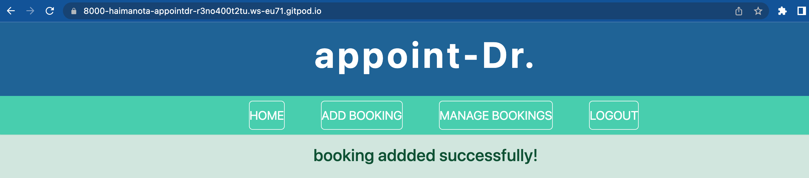

# Appoint-Dr 

Appoint-Dr. is a booking app that is designed for different healthcare facilities like hospitals, clinics and health center. 
The facilities can use this app in order to enable their patients to make bookings online. 
The site will serve anyone who is seeking for a medical care. 

The app will be useful for patients as they can make their booking easily any time. Editing and deleting bookings is also possible.
The health care facilities can benefit from this app since the admin can make a booking online if the patient doesnt waant to do it.
Plus they can see the databases of their booked customers and this app can reduce cost for the facilities.

## Features 

### Existing Features

- __the logo__

The 'appoint-Dr. logo located on the top center of the page indicates clearly to customers 
about the service they can get from the website. 

- __Navigation Bar__

- Featured on all the pages, the responsive navigation bar is identical in each page to enable easy navigation. 
- The user can easily navigate to the sections needed without touching the 'back' button.

The navigation bar displays two different bars depending on the user status. 
 Before making a booking the navigation bar shows the links to Home, Register and Signin. 
 The user need to sign in / sign up first to make a booking.

After the user sign up/ signed in the user is redirected to the page whre he/she can make a booking. 
A message will be displayed on the home page to inform the user that he/she has successfully signed in. 
The nav bar now show Home, Add Boopking, Manage Bookings and Logout. 
The user now have two options to make the booking he can click the Add Booking button 
or the Book Now button to make the bookings.

- The add booking button will take the user to another page where he can fill a form
The form contains patient name, Booking Date, Booking time, after filling out this information
the user is expected to click the Make a Booking button. Then the user will be redirected
to the home page and will be notified that the booking is added successfully. 

Each page has its own functions. 
HOME
The Home page when clicked from any page will redirect the page to the home page. 

Add patient 
enables doctors/admins to register their patients. 
The Add patient form contains First name, Last name, Gender, title, email and phone number. Once they finished filling out the form the can click the button 'Make a booking!' and they can see the booked patient in the admin page.  

Signin / Signup

The patient need to signup first to make a booking. Once they signed up they need be logged in and once they have successfully registered themselves they can make a booking by clicking the 'Book Now' button.

Logout 
The user needs to logout once they are done with the booking. 

Book Now!

The book now button will be visible once the user is logged in. The user can book by clicking this button. 
.

- __The siignup/sign in__ 

- __The Footer__ 

 - The footer section includes information like opening hours, links to the relevant social media sites, and address of the health facility for the patients. The links will open to a new tab to allow easy navigation for the user. 
  - The footer is valuable to the user as it gives them important information regarding the physical address and 
  opening hours. 

  - __The admin Page__

Only the admin can login to this page by using his user name and password.
After logged in the admin can create, read and delete the bookings. 

### Features Left to Implement

_

## Testing 

Automated tests are made to ensure the applicatiion is working as expected. 
Tests are made on models, views and urls files and it has passed without errors. 

## Technologies used

This website is developed using HTML, CSS, Bootstrap, JavaScript and Django programming languages. In addition the tools Gitpod, Github, Git and Heroku are used.
* HTML is used to create the content of the webpage.
* CSS and Bootsrap are used to style and specify and make the layout of the webpage responsive.
* Heroku APP which is a container-based cloud Platform is used to deploy, manage, and scale the project.
* Gitpod is used as an editor to write and run the code.
* Github is employed as code hosting platform, collaboration and securing our code against accidental or malicious loss.
* Git is applied as a version control.

## Deployment

The site was deployed to GitHub pages. The steps to deploy are as follows:
* In the GitHub repository, navigate to the Settings tab.
* From the source section drop-down menu, select the Main Branch, then click "Save".
* The page will be automatically refreshed with a detailed ribbon display to indicate the successful deployment.
The live link can be found here. 

Local Deployment
In order to make a local copy of this project, you can clone it. In your IDE Terminal, type the following command to clone my repository:
* git clone https://github.com/HaimanotA/appoint-Dr..git
Alternatively, if using Gitpod, you can click below to create your own workspace using this repository.

The live link can be found here - https://code-institute-org.github.io/love-running-2.0/index.html 

## Credits 

### Media

- The photo on the home are from google photos.

