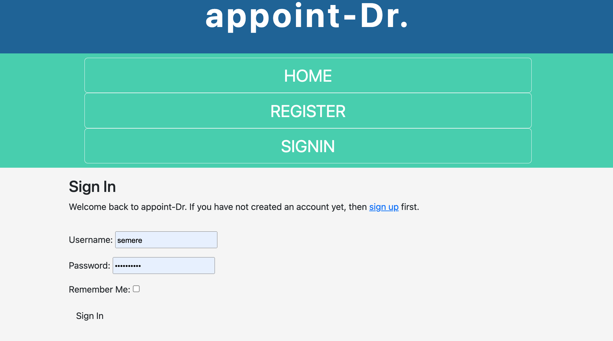

# Appoint-Dr 

Appoint-Dr. is a booking app for healthcare facilities like hospitals, clinics, and health centers. The site will serve anyone who is providing a medical care service. 

The app makes getting a medical service easier for patients as they can make bookings online at any time to visit a doctor. They can also update/change their bookings when they want. 

Healthcare facilities can benefit from this app in so many ways.  The app reduces paperwork, the admin has access to the databases of booked customers, and the admin can add, edit and delete bookings made when needed.
This undoubtedly reduces costs for the facilities. 

## Existing Features 

- __the logo__

The logo on the top center of the page clearly indicates the service customers can get from the website. 

- __the navbar__

Featured on all the pages, the responsive navigation bar is identical on each page to enable easy navigation. 
The user can easily navigate to the sections needed without touching the 'back' button.

The navigation bar displays two different bars depending on the user’s status. 
Before making a booking and before the user sign in, the navigation bar shows the links to Home, Register, and Sign in. 

The user needs to sign in / sign up first to make a booking.

- __Sign in__

The user can click the sign in button on the home page and sign in/sign up depending on whether he has an account. 

The user is then redirected to the page where they can make a booking. 
A message on the home page will inform the user that they have successfully signed in. 

The nav bar shows Home, Add Booking, Manage Bookings, and Logout. 

The user can now click the Add Booking or Book Now button to make a booking.

- __Add Booking__ / __Book Now__

The add booking/ book now button will take the user to another page where he can fill out a form.
The form contains the patient’s name, Booking Date, and Booking time.  After filling out the info
the user can make the booking by clicking the Make a Booking button.  

 Then the user will be redirected to the home page and notified that the booking was successfully added.

- __Log out__

The user can logout after finishing the booking. 

- __Add patient__

The add patient forms enables doctors/admins to register their patients. 
The Add patient form contains First name, Last name, Gender, title, email, and phone number. Once they have finished filling out the form, they can click the button 'Make a booking!' and see the booked patient on the admin page.  

- __Manage Booking__

The manage booking function is designed for the admin to make changes in the booking. To do that
the admin needs to sign in with their account. 
The admin can edit and delete bookings.

The user can also sign in and click the manage bookings button, but the system does not allow them to alter any
bookings. 

- __The Footer__ 

  - The footer section includes information like services, links to the relevant social media sites, and the address of the health facility for the patients. The links will open to a new tab to allow easy navigation for the user. 
  - The footer is valuable to the user as it gives them vital information regarding the physical address and 
  opening hours. 

  - __The admin Page__

Only the admin can login to this page by using his user name and password.
After logged in the admin can create, read and delete the bookings. 

### Features Left to Implement

- The patients who made bookings are unable to see the summary of their bookings.
 Summary of bookings is not implemented. 
 

## Testing 

Automated tests are made to ensure the applicatiion is working as expected. 
Tests are made on models, views and urls files and it has passed without errors. 

## Technologies used

This website is developed using HTML, CSS, Bootstrap, JavaScript and Django programming languages. In addition the tools Gitpod, Github, Git and Heroku are used.
* HTML is used to create the content of the webpage.
* CSS and Bootsrap are used to style and specify and make the layout of the webpage responsive.
* Django framework for creating the app
* Heroku APP which is a container-based cloud Platform is used to deploy, manage, and scale the project.
* Gitpod is used as an editor to write and run the code.
* Github is employed as code hosting platform, collaboration and securing our code against accidental or malicious loss.
* Git is applied as a version control.

## Deployment

The site was deployed to GitHub pages. The steps to deploy are as follows:
* In the GitHub repository, navigate to the Settings tab.
* From the source section drop-down menu, select the Main Branch, then click "Save".
* The page will be automatically refreshed with a detailed ribbon display to indicate the successful deployment.
The live link can be found here. 

Local Deployment
In order to make a local copy of this project, you can clone it. In your IDE Terminal, type the following command to clone my repository:
* git clone https://github.com/HaimanotA/appoint-Dr..git
Alternatively, if using Gitpod, you can click below to create your own workspace using this repository.

The live link can be found here - https://code-institute-org.github.io/love-running-2.0/index.html 

## Credits 

### Media

- The photo on the home are from google photos.